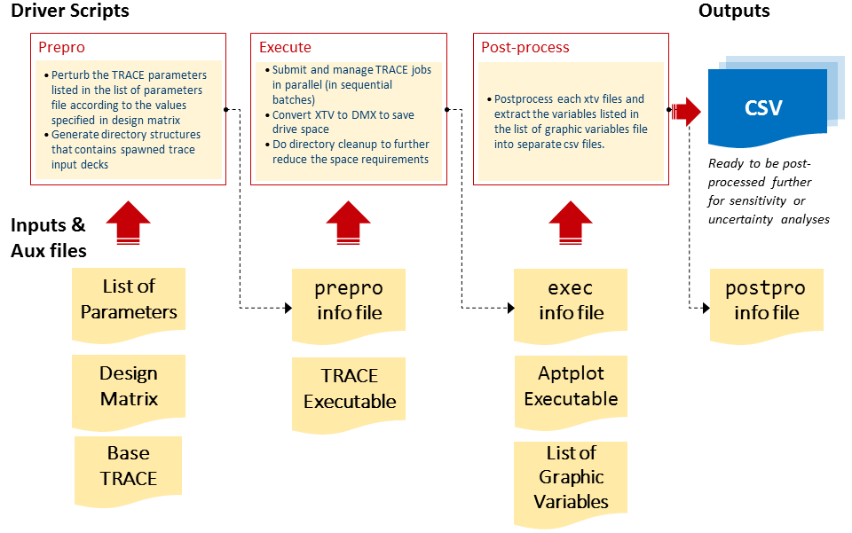

trace-simexp
============

A python module with utilities to assist in carrying out simulation experiment 
with TRACE code.

The general flow chart of the processes involved in ``trace_simexp`` package is

Features
--------

 - Complete separation of the processes in 3 different steps: **prepro**, 
   **exec**, and **postpro**.
 - Three modes of parameter perturbation are supported: additive, 
   multiplicative, and substitutive
 - Four categories of TRACE variables in the input deck can be perturbed:
   spacer grid, material properties, *sensitivity coefficient*, and components
 - For TRACE components, five are supported: PIPE, VESSEL, POWER, FILL, BREAK
 - Specification of the computer experiment by the users is done throug a set 
   of input files (list of parameters file, design matrix file, and list of 
   graphic variables)
 - Iso-probabilistic transformation of the normalized design matrix is 
   available for uniform, discrete, log-uniform, and uniform

Requirements
-----------

The module was developed and tested using the Anaconda Python distribution
with Python v3.5 (https://www.continuum.io/downloads)

Installation
------------

``trace-simexp`` is hosted on `BitBucket`_.

.. _BitBucket: https://bitbucket.org/lrs-uq/trace-simexp

after cloning the source::

    git clone git@bitbucket.org:lrs-uq/trace-simexp.git

the installation can be done easily from the local source directory::

    pip install -e .

This will make the following available in the path:

 - The python module ``trace_simexp``
 - ``trace_simexp_prepro`` executable
 - ``trace_simexp_execute`` executable
 - ``trace_simexp_postpro`` executable
 - ``trace_simexp_create_h5`` executable

Further Documentation
---------------------

A set of documentations is available for ``trace-simexp``. 
The user's guide can be found in the *Usage* section while the contributor's 
guide can be found in the *Implementation* section.
Both sections are combined into a single document in Microsoft Word and 
pdf formats as a `STARS`_ Memorandum document.

.. _STARS: https://www.psi.ch/stars/

Contribute
----------

``trace-simexp`` is hosted on a private repository on `BitBucket`_.
Only those who is a team member of ``lrs-uq`` has access and is allowed to read and/or write. 

- Issue Tracker: https://bitbucket.org/lrs-uq/trace-simexp/issues
- Source Code: https://bitbucket.org/lrs-uq/trace-simexp

License
-------

The project is licensed under the MIT License.