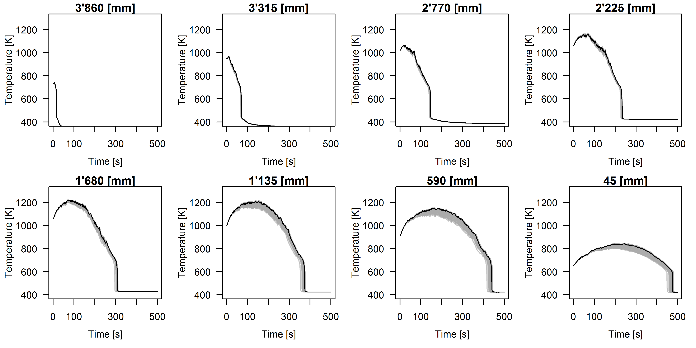
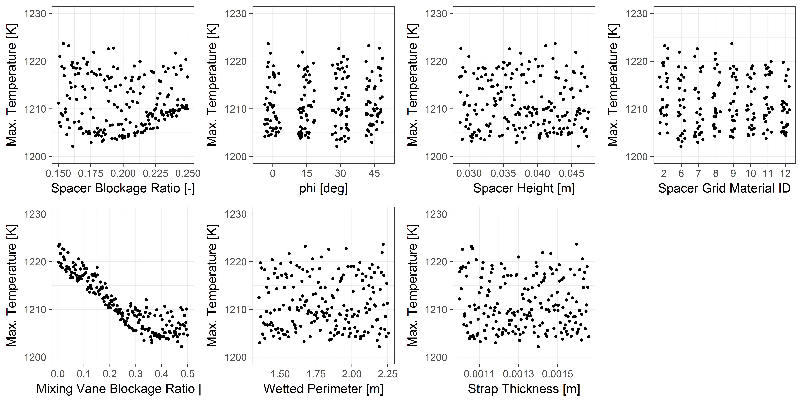
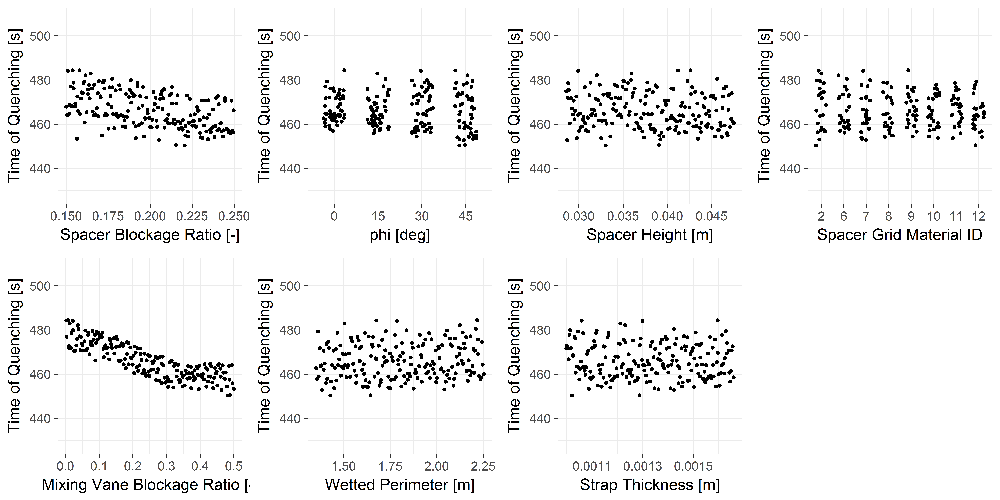

.. _trace_simexp_tutorial:

====================================================================
Tutorial: Simple Uncertainty Propagation of a Reflood Facility Model
====================================================================

In this tutorial, we are going to propagate the uncertainty of parameters
related to the spacer grid model in TRACE in the simulation of a reflood
experimental facility model.

Spacer grid specification in TRACE requires 7 prameters to be specified.  In
the specification of the FEBA reflood facility, given as part of the OECD/NEA
PREMIUM benchmark, only two of those parameters were given explicitly, two were
derived from simple schematic of the test section, and the rest of the
parameters are considered unknown.  Furthermore, the specification also stated
that "the applied spacers were original PWR spacers as used by KWU" which is
not specific enough to obtain the actual technical data.  The table below
summarized the required inputs to fully specify the TRACE spacer grid model.

..
   table 1

=== ========= ======================================================== ============= ================ ================= =========
No. Parameter Description                                              Unit          Allowable Values Nominal Value     Remark
=== ========= ======================================================== ============= ================ ================= =========
1   spbloc    spacer grid blockage ratio                               [-]           :math:`[0.,1.]`  :math:`0.2`       Specified
2   vnbloc    mixing vane blockage ratio                               [-]           :math:`[0.,1.]`  :math:`0.`        Assumed
3   phi       mixing vane angle from parallel with the top of the grid :math:`[^o]`  :math:`[0.,45.]` :math:`0.`        Assumed
4   wetperm   spacer grid wetted perimeter                             [m]           :math:`\geq 0.`  :math:`1.803`     Derived
5   height    spacer grid axial height                                 [m]           :math:`\geq 0.`  :math:`3.8E-2`    Specified
6   strthick  grid strap thickness                                     [m]           :math:`\geq 0.`  :math:`1.3275E-3` Derived
7   spmatid   spacer grid material number                              [-]           :math:`[-]`      Inconel 718       Assumed
=== ========= ======================================================== ============= ================ ================= =========

Note that for the spacer grid material number, TRACE supports 7 built-in material given in the table below

..
   table 2

======= ===================
spmatid Description
======= ===================
2       zircaloy
6       stainless steel 304
7       stainless steel 316
8       stainless steel 347
9       carbon steel A508
10      Inconel 718
11      ZrO2
12      Inconel 600
======= ===================

As such, the unknown parameters have to be assumed and are considered
*uncertain*. To have a robust analysis it is wise to check how the model behave
under the change of these assumptions.  Statistical method is adopted for the
problem of uncertainty quantification where the unknown parameters are modeled
as random variables and allowed to vary within certain ranges.  Furthermore,
the other 4 parameters, though specified, are also allowed to vary around their
respective nominal values.  These parameters are to be sampled and for each
combination of inputs the output will be evaluated.  The dispersion of the
output will give some ideas on how the output of the model behave under the
assumed parameter uncertainties.

In ``trace-simexp``, an uncertain model parameter change its value due to
perturbation by a factor.  This perturbation factor is the one which is modeled
explicitly as random variable, following certain known distribution from which
it can be sampled.  The perturbation factor affects the actual value of model
parameter through three modes of operation:

1. substitutive: the sampled perturbation factor directly substitutes the value of the model parameter
2. additive: the sampled perturbation factor is added to the nominal value of the model parameter
3. multiplicative: the sampled perturbation factor is multiplied to the nominal value of the model parameter

The table below summarizes the specification of the perturbation factor
associated with each of the model parameters.

.. 
   table 3

=== ========= ==================== ================ ====================== =======================
No. Parameter Mode of Perturbation Distribution     Dist. Parameters       Remarks
=== ========= ==================== ================ ====================== =======================
1   spbloc    multiplicative       uniform          min = 0.75, max = 1.25 nominal :math:`\pm 25\%`
2   vnbloc    substitutive         uniform          min = 0.0, max = 0.5   direct substitution
3   phi       substitutive         discrete uniform {0.,15.,30.,45.}       to reduce input space
4   wetperm   multiplicative       uniform          min = 0.75, max = 1.25 nominal :math:`\pm 25\%`
5   height    multiplicative       uniform          min = 0.75, max = 1.25 nominal :math:`\pm 25\%`
6   strthick  multiplicative       uniform          min = 0.75, max = 1.25 nominal :math:`\pm 25\%`
7   spmatid   substitutive         discrete uniform {2,6,7,8,9,10,11,12}   no preferred choice
=== ========= ==================== ================ ====================== =======================

The nature of the present analysis is rather exploratory, with a main purpose
to see how the predicted cladding temperature is dispersed due to the
uncertainties of the model parameters.  This is the main reason to use uniform
distribution within a certain range to model the perturbation factor.
Furthermore, the uncertainties given in the above table are assumed to be
independent.  This, strictly speaking, is not a correct assumption as the strap
thickness and the grid flow blockage ratio are correlated.  The same goes for
the mixing vane angle and the vane blockage ratio.  However, for simplicity, in
line with the purposed of the analysis, the independent assumption is kept.

Conducting Simulation Experiment 
================================

Conducting a simulation experiment on the TRACE code using ``trace-simexp`` is
divided into three main steps:

1. pre-processing
2. execution
3. post-processing

Pre-processing
--------------

The pre-processing step requires three main ingredients:

1. The base TRACE input deck, in which the selected parameters are to be perturbed.
2. The list of parameters file, where the perturbation factors are to be defined.
3. The design matrix file, which contains the value of the perturbation factor normalized, between [0,1].

In this tutorial it is assumed that the base TRACE input deck for the FEBA
facility model is already prepared (given in the tutorial package as
``febaTrans216.inp``).  Furthermore, the values of the perturbation factors are
generated by a certain experimental design.  ``trace-simexp`` accepts
normalized experimental design matrix with different samples written in rows
and different parameters written in columns.  Below is an example of the first
5 entries in a 7-dimensional latin hypercube experimental design::

    1.092710e-03,5.614512e-01,1.161323e-01,8.371081e-01,7.101176e-01,2.959605e-01,5.136827e-01
    5.439255e-03,9.844196e-01,2.142417e-01,9.612770e-02,6.955985e-01,7.804047e-01,9.155945e-02
    1.009063e-02,4.280897e-02,6.611510e-01,4.816894e-01,7.589150e-02,4.572519e-01,3.038666e-01
    1.896974e-02,6.510401e-01,6.152107e-01,8.770555e-01,2.264880e-01,5.790797e-01,2.871109e-01
    2.073383e-02,4.893371e-01,3.778709e-01,6.242067e-01,5.985220e-01,4.555468e-02,7.610146e-02
    ...

The value in this matrix are normalized between [0,1] and the rescaling to the
actual model parameter values will be done by ``trace-simexp`` with the
information provided in the list of parameters file.  The generation of such a
design can be done by generic experimental design packages and it is outside
the scope of this package.  To conduct this tutorial, the package includes a
7-dimensional latin hypercube design of size 200 called ``lhs_200_7.csv``.

What is left is to specify the list of parameters file.  The contents of the
file are a direct translation of the table given above to be parsed by
``trace-simexp``.  It requires basic knowledge on TRACE input deck.  The file
``feba216Vars7.inp`` has the following contents::

    ################################################################################################################################
    #1  2       3   4           5       6   7   8   9           10                                          11                     #
    # Spacer Grid Area Blockage Ratio (spbloc), multiplicative
    1   spacer  1   spbloc      scalar  2   1   3   unif        ['min':0.75, 'max':1.25]                    14.4f
    # Mixing Vane Area Blockage Ratio (vnbloc), substitutive
    2   spacer  1   vnbloc      scalar  2   2   1   unif        ['min':0.0, 'max':0.5]                      14.4f
    # Mixing Vane Angle (phi), discrete choice, substitutive
    3   spacer  1   phi         scalar  2   3   1   discrete    [0.:.25,15.:.25,30.:.25,45.:.25]            14.1f
    # Spacer Grid Wetted Perimeter (wetperm), multiplicative
    4   spacer  1   wetperm     scalar  2   4   3   unif        ['min': 0.75, 'max': 1.25]                  14.4f
    # Spacer Grid Height (height), multiplicative
    5   spacer  1   height      scalar  3   1   3   unif        ['min': 0.75, 'max': 1.25]                  14.4f
    # Grid Strap Thickness (strthick), multiplicative
    6   spacer  1   strthick    scalar  3   2   3   unif        ['min': 0.75, 'max': 1.25]                  14.4e
    # Spacer Grid Material (spmatid), discrete choice, substitutive
    7   spacer  1   spmatid     scalar  3   3   1   discrete    [2:.125,6:.125,7:.125,8:.125,9:.125,10:.125,11:.125,12:.125]    14d
    ################################################################################################################################

The lines starting with ``#`` are comment lines which will not be parsed.  The
rest of the columns is as follows (note that the ordering has to be strictly
kept and each column has to be separated by at least one space character):

1. the first column is the enumeration of the parameters or perturbation factors.
2. the second column is the ``trace-simexp`` data type of the parameter.
   The data types are associated with TRACE components.
   Four types are currently supported, and type ``spacer`` is one of them.
3. the third column is the unique TRACE component ID of the type.
   In the example above the parameters are associated with spacer grid with ID **1** in the TRACE input deck.
4. the fourth column is the variable name. 
   The entry above follows the entry of the second column of Table 3 above.
5. the fifth column signify the data structure of the pertubation factor. 
   Here all of the parameters are of ``scalar`` type which means that in TRACE a single number is used to specify the value of the parameter.
   There are other type of data structure used in TRACE such as ``table`` (a series of tuple of values) and ``array``.
6. the sixth column is the ``card`` number of that variable.
   ``card`` is TRACE input deck terminology used to designate the line (relative to the component declaration) at which the variable is to be specified.
7. the seventh column is the ``word`` number of the variable.
   ``word`` is another TRACE input deck terminology used to designate the column at which the variable is to be specified.
8. the eighth column is the mode of perturbation ID. 
   Three modes are currently supported: substitutive (ID = 1), additive (ID = 2), and multiplicative (ID = 3).
9. the ninth column is the probability distribution type of the perturbation factor.
   It is used to rescale the normalized value given in the design matrix file to the actual value of the model parameter perturbation.
   The entries above follow the entries of the fourth column of Table 3 above.
10. the tenth column is the parameters of the distribution given as a set of keyword-value pairs enclosed in square brackets.
    The valid pair depends on the probability distribution type given in the ninth column.
    From the above example, 
    for a uniform distribution 2 parameters need to be specified (the minimum and the maximum),
    while discrete distribution requires the values and their respective probabilities to be specified.
11. the eleventh column is the string formating specification of TRACE input deck.
    It follows the same fortran string formating syntax used in TRACE.

The variable name, ``card`` and ``word`` numbers seem to be redundant, but they
are all kept to force user to be precise in designating model parameter to be
perturbed. 

Finally, given all these ingredients the pre-processing step can be invoked in
the terminal using the following command::

    trace_simexp_prepro -tracin febaTrans216.inp \
                        -parlist feba216Vars7.inp \
                        -dm lhs_200_7.csv \
                        -prepro_info ./prepro-tutorial.nfo

The results of invoking the above command is a set of perturbed TRACE input
decks inside a directory structure::

    .
    |+---febaTrans216
    |   +---feba216Vars7-lhs_200_7
    |       +---febaTrans216-run_1
    |           febaTrans216-run_1.inp
    |       +---febaTrans216-run_2
    |           febaTrans216-run_2.inp
    |       +---febaTrans216-run_3
    |           febaTrans216-run_3.inp
    |
    ...
    |       +---febaTrans216-run_200
    |           febaTrans216-run_200.inp

Additionally, an info file of the pre-processing phase ``prepro-tutorial.nfo``
is created.

Running TRACE
-------------

After the perturbed TRACE input decks have been generated in their respective run directories,
they can be executed sequentially in batch using the command line interface ``trace_simexp_execute`` as follows::

    trace_simexp_execute -prepro prepro-tutorial.nfo \
                         -trace trace_v5.0p3.uq_extended \
                         -xtv2dmx xtv2dmx_v6.5.2_inst01.sh  \
                         -nprocs 12 \
                         -exec_info ./exec-tutorial.nfo

It is assumed from executing above command that the executables 
``trace_v5.0p3.uq_extended`` and ``xtv2dmx_v6.5.2_inst01.sh`` are both available in the PATH.
Additionally, 12 processors are assigned to execute the samples simultaneously
(that is, run 12 perturbed input decks at once).

.. note::

    To avoid failed operation due to broken interactive session to the ``lclrs`` machine, 
    it is advised to send the job in the background while keeping the credential using::

        k5run -B trace_simexp_execute -prepro prepro-tutorial.nfo \
                                      -trace trace_v5.0p3.uq_extended \
                                      -xtv2dmx xtv2dmx_v6.5.2_inst01.sh  \
                                      -nprocs 12 \
                                      -exec_info ./exec-tutorial.nfo >& exec-tutorial.log &

Succesful completion of the execute step results in a set of ``dmx`` files produced in each of the run directories::

    .
    |+---febaTrans216
    |   +---feba216Vars7-lhs_200_7
    |       +---febaTrans216-run_1
    |           ...
    |           febaTrans216-run_1.dmx
    |       +---febaTrans216-run_2
    |           ...
    |           febaTrans216-run_2.dmx
    |       +---febaTrans216-run_3
    |           ...
    |           febaTrans216-run_3.dmx
    |
    ...
    |       +---febaTrans216-run_200
    |           ...
    |           febaTrans216-run_200.dmx

Post-processing
---------------

In ``trace-simexp`` the term *post-processing* refers to extracting a set of select TRACE output of interest 
from the binary ``xtv`` or ``dmx`` file to a separate text file, often delimited by comma (``csv`` file).
To post-process the resulting ``dmx`` files, 
the user needs to specify a  *list of TRACE graphic variable file* 
which simply contains the keys identifier of TRACE graphic variables to be extracted (see TRACE user's manual for detail).
The file for this tutorial (``select_vars.apt``) contains the following entries::

    rftn-20A19R29  # clad temperature at    45 [mm]
    rftn-20A34R29  # clad temperature at   590 [mm]
    rftn-20A49R29  # clad temperature at 1'135 [mm]
    rftn-20A69R29  # clad temperature at 1'680 [mm]
    rftn-20A89R29  # clad temperature at 2'235 [mm]
    rftn-20A109R29 # clad temperature at 2'770 [mm]
    rftn-20A124R29 # clad temperature at 3'315 [mm]
    rftn-20A139R29 # clad temperature at 3'860 [mm]

As the key to TRACE graphic variable is often cryptic,
It is a good idea to include comments using ``#`` either in-line or otherwise.

Given the list of TRACE graphic variables file and the previous step info file,
the post-processing can be invoked from the terminal using::

    trace_simexp_postpro -exec exec-tutorial.nfo \
                         -vars select_vars.apt \
                         -aptplot aptplot_v6.5.2_inst01.sh \
                         -postpro_info ./postpro-tutorial.nfo \
                         -nprocs 10

In this example, the process is not sent in the background because having short
list of extracted variables as above is not CPU demanding and can be waited.
Invoking the command above it is assumed that the program
``aptplot_v6.5.2_inst01.sh`` is available in the PATH and that a X11 library is
available (e.g. X11 forwarding on Putty client and Xming running).  Succesful
completion of the post-processing phase results in a set of ``csv`` files
produced in each of the run directories::

    .
    |+---febaTrans216
    |   +---feba216Vars7-lhs_200_7
    |       +---febaTrans216-run_1
    |           ...
    |           febaTrans216-run_1-select_vars.csv
    |       +---febaTrans216-run_2
    |           ...
    |           febaTrans216-run_2-select_vars.csv
    |       +---febaTrans216-run_3
    |           ...
    |           febaTrans216-run_3-select_vars.csv
    |
    ...
    |       +---febaTrans216-run_200
    |           ...
    |           febaTrans216-run_200-select_vars.csv

At this point the tasks which ``trace-simexp`` is designed to perform are complete.
The user is free to post-process further the resulting ``csv`` files 
to answer the initial questions related to uncertainty or sensitivity analyses.
Below are some examples of how the results can be processed further.

Results
=======

To get an idea how the output of interest are dispersed due to the model parameters variations, 
the first step is often simply plotting the results of all samples.
The figure below shows the clad temperature evolution at 8 different axial locations.

.. TODO: include axial locations

As it can be seen the dispersion at each axial elevation is relatively minor
given the assumed large model parameters input uncertainties. The dispersion
also tends to widen going from the bottom to the top.

Another example of simple exploratory analysis is to make a scatter plot between 
a chosen quantity of interest and the sampled parameter values.
A typical quantity of interest in reflood simulation is the maximum temperature 
or the time of quenching.

A set of scatter plots between maximum temperature and each of the parameters
is given in the figure below.  It can be seen that the range of maximum
temperature variation in the sample is approximately between :math:`1'200` [K]
and :math:`1'225` [K], which in the context of reflood simulation is considered
minor. There are no apparent trend in the scatter plots except for the spacer
and mixing vane blockage ratios, with the mixing vane blockage ratio showing a
very strong correlation with the maximum temperature.

.. TODO: increase size of pictures

A similar set of scatter plots now for the time of quenching at an elevation of
:math:`3.86` [m] as the quantity of interest is given below.  The range of
variation in the sample is approximately between :math:`450` [s] and
:math:`490` [s].  Similar to the results for maximum temperature, only the two
blockage ratios showed strong correlations with the time of quenching.

