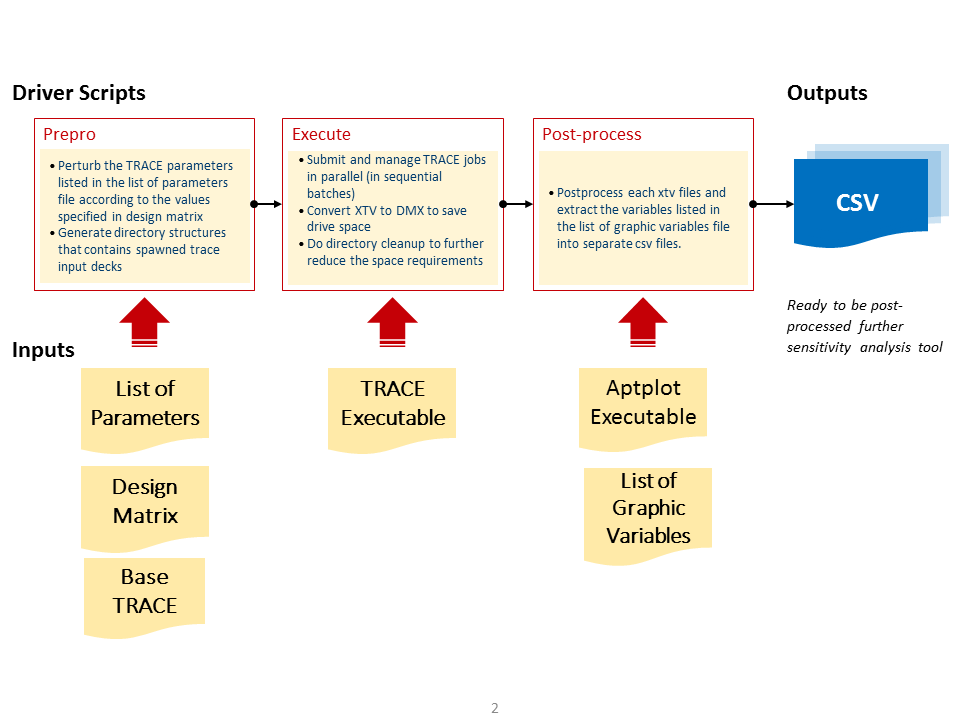

# TRACE-SIMEXP v1.0 - Scripting Utility for TRACE Simulation Experiment

## STARS Memorandum

Date: 23.06.2016
From: D. Wicaksono
Phone: +41 56 310 2759
Loc.: OHSA/D08
Email: damar.wicaksono@psi.ch

To: 
 1. STARS / O. Zerkak
 2. STARS / Y. Aounallah
 3. ERP / G. Perret

cc:
 1. STARS / STARS_TRACE
 2. STARS / M. Krack
 3. STARS / H. Ferroukhi 

## Abstract

A computer experiment is a multiple model runs using different values of 
the model parameters. Its design, in particular the selection of the 
design points, as well as its analysis, in particular the analysis of 
the output variation in relation to the inputs variation, are useful for 
sensitivity and uncertainty analyses of the model subjected to the 
experimentation.

a Python3-based scripting utility has been developed to assist in the 
logistical aspects of carrying such experiments for TRACE code. 
The scope of the utility is ranging from the pre-processing the TRACE 
input deck amenable for batch parallel execution to the post-treatment 
of the resulting binary xtv file amenable to sensitivity and uncertainty 
analyses. This memorandum describes the development of the tool, 
including the descriptions on its implementation, its assumptions, 
as well as its usage.

## Introduction and Scope of the Utility
 
<!--TODO Give short background, emphasize on the current version and its use cases--> 

This version and the features were consolidated from the developments
made for the PSI contributions to the PREMIUM Phase-IV benchmark, 
the NUTHOS-11 conference, and the NURETH-16 conference.

## Description of Features (v1.0)

<!--TODO Give short listing of features that have been implemented so far --> 

## Implementation

<!--TODO Some notes on implementation--> 

### Assumptions

<!--TODO Carefully mention/list the assumptions used--> 

### Usage

<!--TODO General usage of the utility--> 

### Step 1: Preprocessing

<!--TODO What does the prepro phase do?--> 

### Step 2: Execute

<!--TODO What does the exec phase do?--> 

### Step 3: Postprocessing

<!--TODO What does the postpro phase do?--> 

### The list of parameters file

<!--TODO Carefully describe the syntax of `paramlist` file--> 

### The design of experiment file

<!--TODO Carefully describe the syntax of design of experiment file--> 

### The list of graphic variable file

<!--TODO Carefully describe the syntax of list of graphic variable--> 

### Distribution 

<!--TODO How the utility being distributed within STARS--> 

## Examples of Use Cases

<!--TODO Some example of use cases-->
